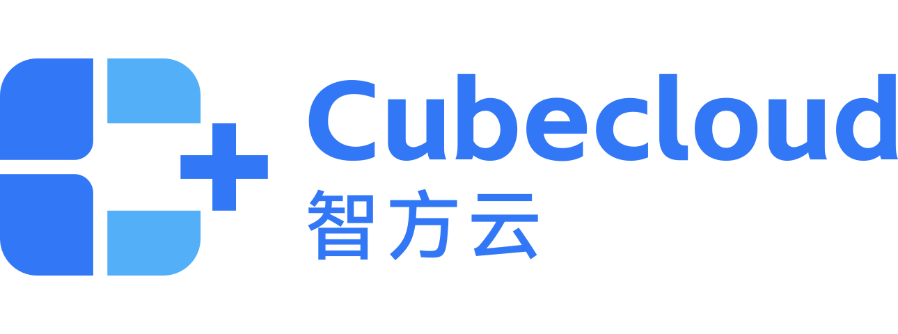
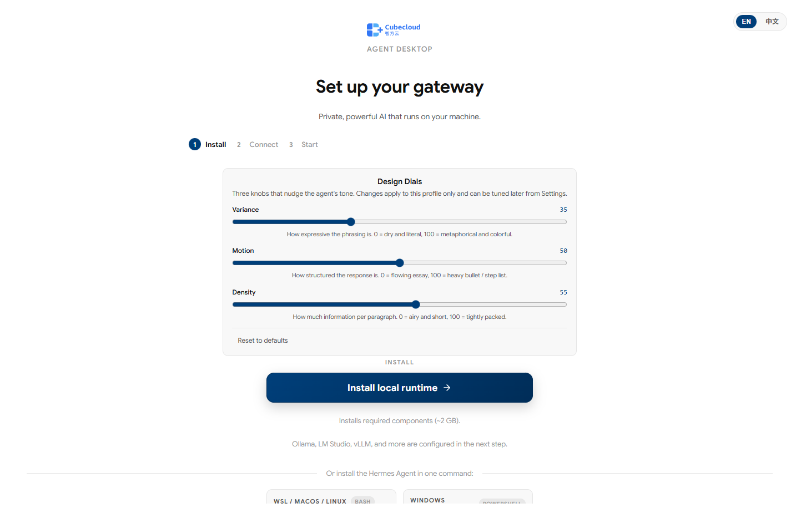
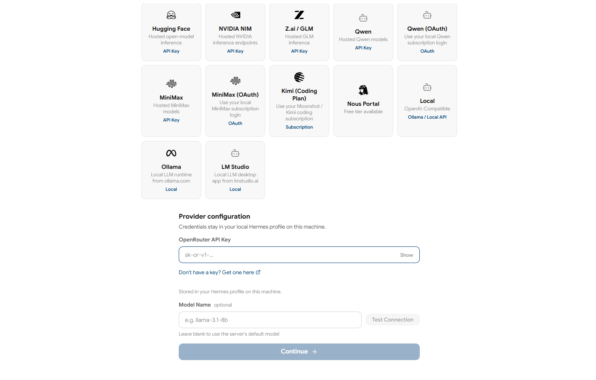
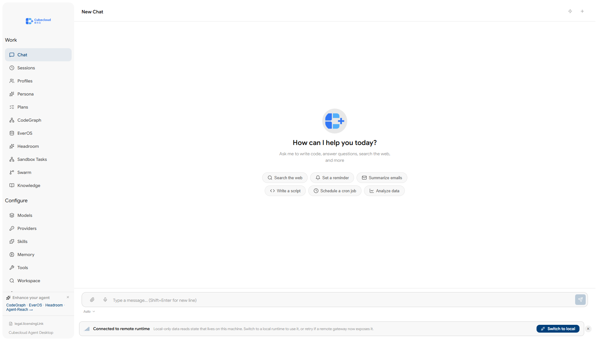
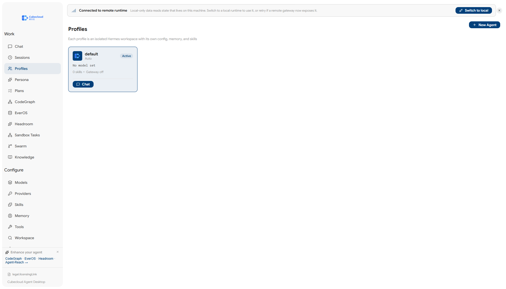
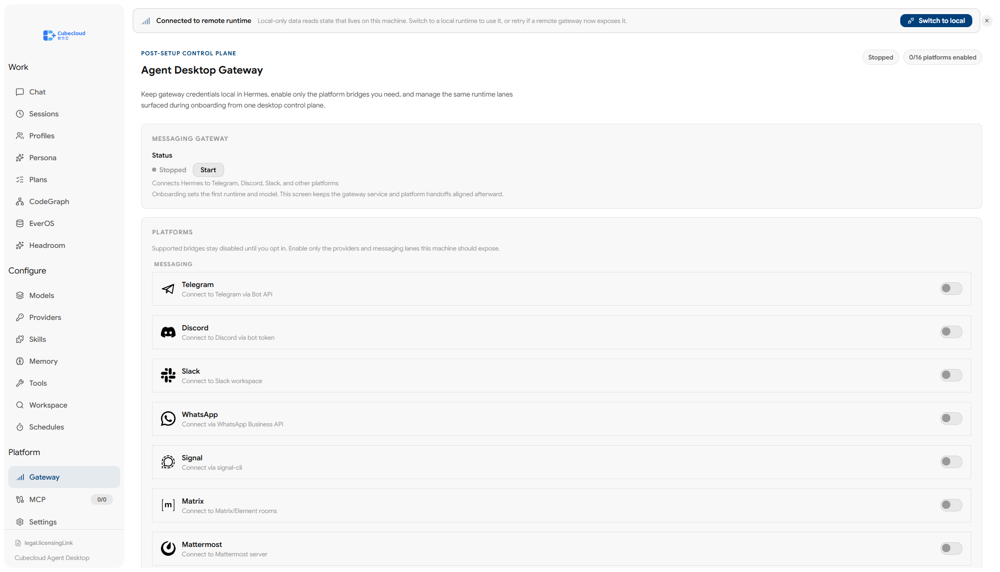
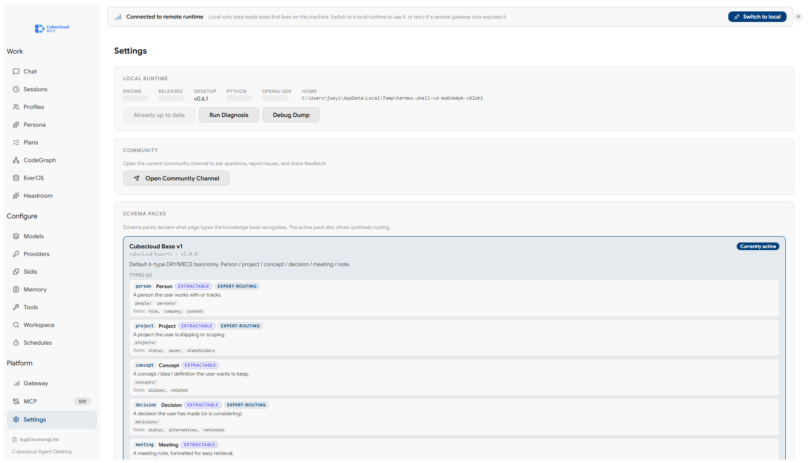

<p align="center">
  
</p>

## 최신 릴리스: **v2.10.71**

Windows 설치 프로그램은
[v2.10.71 릴리스 페이지](https://github.com/JZKK720/cubecloud-agentic-os/releases/tag/v2.10.71)
에서 다운로드하세요:

- `cubecloud-agent-desktop-2.10.71-setup.exe` (130 MB, NSIS 원클릭 설치 프로그램)
- `cubecloud-agent-desktop-2.10.71-portable.exe` (109 MB, 단일 파일 포터블)
- `cubecloud-agent-desktop-2.10.71-setup.exe.blockmap` + `latest.yml` (자동 업데이트 메타데이터)

v2.10.71은 **래퍼 폐기 이후의 첫 빌드**입니다. `agent-desktop/`
(모노레포 루트가 아닌)에서 빌드되었으며, asar에는 21,291개의
`node_modules/` 항목(176.92 MB)이 포함되어 있고 `verify:bundle`은
7/7 PASS입니다. 전체 변경 로그는
[`agent-desktop/changelogs/2.10.71.md`](agent-desktop/changelogs/2.10.71.md)를
참조하세요. v0.6.0과 v0.6.1은 GitHub에서 프리릴리스로 표시되어
있으며, 폐기된 `apps/desktop-shell/` 래퍼 트리에서 빌드되었으므로
사용하면 안 됩니다.

설치 지침, 런타임 선택기 세부 정보, 프로바이더 설정은
[`agent-desktop/README.md`](agent-desktop/README.md)를 참조하세요.

# Cubecloud Agentic-OS 한국어 문서（ko-KR）

[English](README.md) · [简体中文](README.zh-CN.md) · [日本語](README.ja-JP.md) · **한국어**

> **이식성, 감사 가능성, 더 낮은 AI 운영 비용을 원하는 팀을 위한 로컬-퍼스트 에이전트 데스크톱 및 운영 모델.**
> Cubecloud는 런타임, 프로바이더, 스킬, 메모리, 스케줄, 선택적 코드 인텔리전스를
> 하나의 제어 평면으로 통합하며, 사용자의 머신을 호스팅 래퍼의 thin client로 만들지 않습니다.

Cubecloud Agentic-OS는 **Cubecloud Agent Desktop** 및 그 운영 모델을 위한 모노레포입니다.
데스크톱 바이너리는 [`agent-desktop/`](agent-desktop/)에 있습니다.
공유 TypeScript 계약과 개발자용 스킬 생태계는
[`packages/platform-core/`](packages/platform-core/), [`.agents/`](.agents/)에 있습니다.

네 줄로 요약하면:

- 프롬프트, 스킬, 메모리, 런타임 선택을 파일, SQLite, 명시적 로컬 계약으로 관리합니다.
- 일상적인 반복 작업은 가능한 한 로컬에서 실행하고, 유료 원격 추론은 진정으로 가치 있는 턴에만 사용합니다.
- 런타임과 프로바이더를 전환할 때 전체 운영 모델을 다시 작성할 필요가 없습니다.
- 개발자와 운영자에게 CLI, 브라우저 탭, 벤더 대시보드의 집합이 아닌 하나의 데스크톱 제어 평면을 제공합니다.

## 미리보기

다음은 데스크톱 핵심 화면의 큐레이션입니다. 처음 읽는 분이 아키텍처 섹션을 읽기 전에 살펴봐야 할 화면을 모았습니다.
모든 이미지는 현재 데스크톱 빌드의 전체 페이지 캡처입니다. 온보딩, 런타임 감지, 사이드바에서 노출되는 모든 주요 운영자 화면을 다루는 22장짜리 전체 갤러리는
[`agent-desktop/README.md`](agent-desktop/README.md#preview) 에 있습니다.

<table>
<tr>
<td width="50%" align="center"><b>환영 &amp; 첫 실행</b><br/></td>
<td width="50%" align="center"><b>런타임 감지</b><br/></td>
</tr>
<tr>
<td width="50%" align="center"><b>채팅</b><br/></td>
<td width="50%" align="center"><b>프로필 &amp; 에이전트</b><br/></td>
</tr>
<tr>
<td width="50%" align="center"><b>게이트웨이 (16개 플랫폼)</b><br/></td>
<td width="50%" align="center"><b>설정 &amp; 제어</b><br/></td>
</tr>
</table>

## 팀이 Cubecloud를 채택하는 이유

Cubecloud는 데스크톱 제품의 편리함을 원하면서도 스택에 대한 제어권을 포기하고 싶지 않은 팀을 위한 것입니다.

| 결과 | Cubecloud의 실현 방법 |
|---|---|
| 첫 번째 가치 있는 세션까지의 시간 단축 | 사전 실행 번들은 3개의 사용자 대상 스킬(`cubecloud-persona`, `cubecloud-onboarding`, `cubegraph-code-intel`), 5개의 샘플 작업이 담긴 스타터 칸반 보드, 기본 모델 레지스트리를 데스크톱에 미리 채워 둡니다. 도구, 에이전트, 스킬, 스케줄, 메모리, 페르소나, 지식 그래프, 파일 관리 화면이 첫날부터 모두 활성화되어 있어, 사용자는 빈 셸을 마주하는 대신 바로 작업을 시작할 수 있습니다. |
| 운영 비용 절감 | 로컬-퍼스트 레인이 초안 작성, 검색, 오케스트레이션, 반복을 기존 하드웨어에서 처리하며, 원격 프론티어 모델은 선택 사항으로 유지됩니다. |
| 벤더 리스크 감소 | 런타임 선택과 프로바이더 선택이 별개의 결정이므로, 모델이나 벤더 변경은 시스템 재작성이 아닌 재구성 이벤트입니다. |
| 재현 가능한 운영자 워크플로 | 스킬, 스케줄, 프로바이더 정의, 상태가 호스팅 블랙박스가 아닌 검사 가능한 파일, SQLite, 명시적 IPC 표면에 저장됩니다. |
| 조달 및 법무 검토 용이성 | Cubecloud 오리지널 작업은 AGPL-3.0-or-later, Apache-2.0, MIT 중 선택 가능하며, 상속된 프레임워크는 MIT로 유지되고 경로 수준 출처가 명확히 문서화됩니다. |

## 로컬-퍼스트가 우위인 이유

여기서 "로컬-퍼스트"는 마케팅 수사가 아니라 제어 평면의 소재, 비용 구조, 장애 검사 가능성에 대한 명확한 선택입니다.

| 판단 축 | 호스팅 래퍼 기본값 | Cubecloud 로컬-퍼스트 모델 |
|---|---|---|
| 제어 평면 | 벤더 계정, 벤더 UI, 벤더 유지 루프 | 로컬 사용자 통제 하의 네이티브 데스크톱 |
| 비용 구조 | 시트 비용 + 토큰 비용 + 래퍼 경제 | 일상 작업은 가능한 한 로컬 하드웨어로 처리, 원격 비용은 진정한 가치가 있을 때만 발생 |
| 상태와 출처 | 이력과 오케스트레이션 상태가 주로 호스팅 제품 내에 존재 | 프롬프트, 스킬, 스케줄, 메모리가 검사 및 재현 가능 |
| 런타임 변경 | 종종 제품 전환이나 벤더 추상화 제한 수용을 의미 | 런타임 피커가 운영 표면을 안정적으로 유지하면서 기반 런타임 진화를 허용 |
| 프로바이더 변경 | 일반적으로 벤더 우선, BYOK는 부차적 | 프로바이더 레이어가 명시적이며 런타임 레이어와 분리 |
| 장애 복구 | 벤더 수정 대기 또는 제한된 로그 확인 | 로컬 상태, 로그, 설정, IPC 경계를 직접 검사 |

**BYOK는 조달 관리입니다. 로컬-퍼스트는 운영 모델입니다.**
BYOK가 바꾸는 것은 청구서의 수신처입니다. 로컬-퍼스트가 바꾸는 것은 그 워크플로가 애초에 얼마나 많은 유료 원격 작업을 필요로 하는가입니다.

## 누구를 위한 것인가

Cubecloud는 다음과 같은 팀과 운영자에게 특히 적합합니다:

- 보안 검토, 출처 검토, 롤백 경로가 필요한 내부 에이전트 도구를 구축하는 팀.
- 클라이언트별로 다른 에이전트 스택을 제공해야 하며 모든 배포를 동일한 호스팅 래퍼에 결합하고 싶지 않은 컨설팅 회사 및 플랫폼 팀.
- 데스크톱의 편리함을 원하면서도 로컬 런타임 제어를 포기하고 싶지 않은 개발자.
- 빈번한 반복 작업을 로컬에 유지하고 필요한 경우에만 원격 모델을 사용하려는 비용 의식이 강한 운영자.

순수 브라우저 제품, 호스팅 SaaS 제어 평면, 또는 모델 벤더가 런타임 라이프사이클 전체를 대신 관리해주길 원한다면 최적의 선택이 아닙니다.

## 이 리포지토리가 제공하는 것

이 모노레포가 제공하는 것은 데스크톱 바이너리만이 아닙니다.

- [`agent-desktop/`](agent-desktop/)은 최종 사용자에게 제공되는 완전한 Electron 데스크톱입니다. 유일한 활성 구현 대상이며 모든 빌드 결과물은 여기에서 생성됩니다.
- [`packages/platform-core/`](packages/platform-core/)는 공유 TypeScript 계약을 보유합니다.
- [`.agents/skills/`](.agents/skills/)에는 {{SKILLS_REPOS}}개 업스트림 리포지토리에서 적응된 49개의 오픈소스 스킬이 들어 있습니다. 이것들은 **컨트리뷰터 대상** 스킬이며, 이 monorepo 안에서 Copilot / Claude Code 세션을 돌리기 위한 소스 트리에 존재합니다. **데스크톱 바이너리에는 포함되지 않습니다**. 데스크톱 최종 사용자가 보는 것은 별개의 묶음입니다: asar 내부에 동봉되는 [28개의 데스크톱 내장 스킬](agent-desktop/.agents/skills/)이며, Skills → Browse 탭에 표시됩니다. 3개 계층의 전체 구분은 [`agent-desktop/README.md`](agent-desktop/README.md#skills-ecosystem--3-layers)를 참고하세요.
- [`docs/`](docs/)는 핸드북, 위협 모델, 런타임 계획, 법적 정책, 전환 이력을 보유합니다.

데스크톱 첫 실행 시 사용자는 다음을 얻습니다:

- React 19, i18next, Vite, electron-builder로 구축된 네이티브 Electron 데스크톱.
- 멀티 런타임 피커: 현재는 Hermes, 향후 OpenClaw와 IronClaw가 추가 레인으로 계획됨.
- 런타임 레이어와 분리된 프로바이더 레이어. Ollama, vLLM, llama.cpp 등의 로컬 프로바이더 또는 OpenAI 호환 원격 API에 연결 가능.
- 첫 실행부터 사용자에게 표시되는 3개의 스킬: `cubecloud-persona`, `cubecloud-onboarding`, `cubegraph-code-intel`.
- **3개의 사용자 대상 스킬**(`cubecloud-persona`, `cubecloud-onboarding`, `cubegraph-code-intel`), **5개의 샘플 작업이 담긴 스타터 칸반 보드**, 에이전트가 첫날부터 바로 연결할 수 있는 공급자를 나열한 **기본 모델 레지스트리**를 포함한 사전 실행 운영 컨텍스트. Tools, Agents, Skills, Schedules, Memory, Soul(페르소나), Memory(wiki), Workspace(파일), Settings 화면이 첫날부터 모두 가동되어 즉시 사용 가능합니다.
- 사용자가 명시적으로 활성화하는 선택적 CodeGraph 및 EverOS 통합 (자동 설치되지 않음).

**하지 않는** 일:

- 모델 서버가 **아닙니다**. 추론을 번들링하지 않고 런타임 및 프로바이더 프로토콜을 소비합니다.
- 호스팅 IDE가 **아닙니다**. 데스크톱이 로컬 제어 표면입니다.
- 단일 벤더 래퍼가 **아닙니다**. 런타임 선택, 프로바이더 선택, 스킬 자산이 이식 가능하게 유지됩니다.

## 시장 포지셔닝

Cubecloud는 "최고의 클라우드 Copilot", "가장 강력한 단일 벤더 CLI", "가장 가벼운 데모 템플릿"이 되려는 것이 아닙니다.
다른 구매자를 대상으로 합니다: 제어, 이식성, 단위 경제를 가장 중시하는 팀입니다.

| 시장 옵션 | 강점 | 제약 | Cubecloud의 위치 |
|---|---|---|---|
| Cursor, GitHub Copilot agents 등의 클라우드 IDE Copilot | 호스팅 코딩 루프가 빠르고 IDE 통합이 깊음 | 상태가 기본적으로 클라우드, 시트 경제가 무겁고 제어 평면이 벤더 중심 | Cubecloud는 로컬 데스크톱 운영자를 중심에 두고 런타임, 프로바이더, 스킬 자산을 교체 가능하게 유지 |
| Claude Code, Codex CLI 등의 단일 벤더 CLI | 특정 벤더 스택에서의 터미널 네이티브 루프가 강력 | 터미널 우선 UX, 런타임 이식성이 좁음 | Cubecloud는 GUI 우선 제어 평면과 이식 가능한 런타임/프로바이더 모델을 제공 |
| 레퍼런스 리포지토리와 퀵스타트 | 학습과 데모 시작이 빠름 | 의견을 가진 운영 표면이나 장기 운영자 워크플로가 부재 | Cubecloud는 실제 데스크톱 워크플로, 핸드북, 시드된 컨텍스트, 문서화된 출처 자세를 제공 |
| BYOK 래퍼 | 조달과의 대화가 용이 | 종종 토큰 비용에 더해 래퍼 시트 경제가 추가됨 | Cubecloud는 로컬-퍼스트 설계로 워크플로가 유료 원격 추론에 의존하는 정도를 감소 |

전략적 포인트는 간단합니다: 많은 경쟁사가 **벤더 깊이**를 최적화합니다. Cubecloud는 **운영자 제어**를 최적화합니다.

## 프로덕션 지향 팀을 위해

Cubecloud가 말하는 "프로덕션 대응"이란 "호스팅 SaaS와 영업 대시보드"가 아니라 핵심 운영 표면이 명시적이고 검사 가능하며 교체 가능하다는 것을 의미합니다.

- **명시적 신뢰 경계.** 렌더러는 샌드박스화되고, IPC 채널은 명시적으로 정의되며, 아웃바운드 네트워킹은 기본적으로 옵트인, 인바운드 네트워킹은 사용자 지정 포트에서 옵트인입니다. [`SECURITY.md`](SECURITY.md) 및 [`THREAT_MODEL.md`](THREAT_MODEL.md) 참조.
- **예측 가능한 상태.** 프로필, 세션, 프로바이더 정의, 메모리, 스케줄, 칸반 상태가 불투명한 호스팅 워크플로 레이어가 아닌 영구적인 로컬 상태에 저장됩니다.
- **교체 가능한 종속성.** 런타임 선택과 프로바이더 선택이 분리되어 있어 팀이 전체 사용자 워크플로를 붕괴시키지 않고 마이그레이션, 스테이징, 롤백할 수 있습니다.
- **선택적 사이드카는 선택적으로 유지.** CodeGraph와 EverOS는 필요할 때 시스템을 확장하지만 필수적인 숨겨진 플랫폼 종속성이 되지 않습니다.
- **버전 관리된 방법론.** {{SKILLS_UPSTREAM}}개 스킬 생태계는 문서화되고 출처가 추적되며 업스트림 스킬 프로세스에서 상속된 red-baseline 규율로 지원됩니다.
- **명확한 법적 표면.** 리포지토리는 경로 수준 출처, 상표 자세, 상업적 재라이선스 정책, 상속 프레임워크의 MIT carve-out을 한 곳에서 문서화합니다. [`BRANDING_AND_LICENSE.md`](BRANDING_AND_LICENSE.md) 및 [`docs/legal/`](docs/legal/) 참조.

이것이 엔터프라이즈 스토리입니다: "우리를 믿으세요"가 아니라 "스택을 검사하세요".

## 아키텍처 개요

데스크톱 경험은 3개의 협력하는 레이어로 구성됩니다:

**코어 런타임 레이어**
- **상태 레이어** - [`agent-desktop/src/main/agentControlPlane.ts`](agent-desktop/src/main/agentControlPlane.ts)가 프로필, 세션, 모델, 프로바이더, 스킬, 메모리, 스케줄, 칸반 상태를 관리.
- **런타임 오케스트레이션** - [`docs/RUNTIME_ORCHESTRATION_PLAN.md`](docs/RUNTIME_ORCHESTRATION_PLAN.md)가 현재 Hermes 레인과 다음 OpenClaw / IronClaw 레인을 설명.
- **프로바이더 레이어** - [`agent-desktop/src/main/providerDiscovery.ts`](agent-desktop/src/main/providerDiscovery.ts)가 모델 프로바이더 선택을 런타임 선택과 분리.
- **스킬 하네스** - [`agent-desktop/src/main/skills-harness.ts`](agent-desktop/src/main/skills-harness.ts)가 발신 요청 주위에 스킬 레이어를 적용.

**통합 지원 표면**（선택적, 사용자가 명시적으로 활성화）
- **CodeGraph 표면** - [`docs/CODEGRAPH-RUNTIME.md`](docs/CODEGRAPH-RUNTIME.md)가 선택적 시맨틱 코드 인텔리전스 경로를 설명.
- **EverOS 사이드카** - [`docs/EVEROS-SIDECAR.md`](docs/EVEROS-SIDECAR.md)가 선택적 메모리 및 하네스 사이드카의 라이프사이클을 설명.

**사용자 관리 타사 애플리케이션**
- 데스크톱은 운영자가 이미 사용 중인 도구에 연결할 수 있습니다. 예: Open WebUI, OpenCode, Warp ADE, VS Code, Ollama, LM-Studio, Odysseus, ComfyUI, Open Design. 이들은 번들되지 않고 필수도 아니며 사용자가 추가하거나 제거할 수 있습니다.

## 시작하기

- **새 기여자:** [`docs/HANDBOOK.md`](docs/HANDBOOK.md) 섹션 1, 2, 3, 5를 읽으세요.
- **데스크톱 평가자:** 먼저 [`agent-desktop/README.md`](agent-desktop/README.md)를 읽은 후 [`docs/HANDBOOK.md`](docs/HANDBOOK.md) 섹션 1, 3, 10을 읽으세요.
- **리뷰어 또는 릴리스 담당자:** [`docs/HANDBOOK.md`](docs/HANDBOOK.md) 섹션 1, 3, 4, 6, 9, 10, 11을 순서대로 읽으세요.

## 리포지토리 레이아웃

```
cubecloud-agentic-os/
├── README.md                     이 모노레포 README
├── LICENSE                       Cubecloud 오리지널 작업: AGPL-3.0-or-later / Apache-2.0 / MIT
├── NOTICE                        서드파티 귀속 카탈로그
├── BRANDING_AND_LICENSE.md       라이선스, 출처, 버전 전환 이력
├── CONTRIBUTING.md               DCO 1.1 기여 계약
├── SECURITY.md                   보안 정책 및 보고 방법
├── THREAT_MODEL.md               로컬-퍼스트 위협 모델
├── README.i18n.md                번역 인벤토리 매니페스트
├── .agents/                      ~/.agents/skills/로 미러링되는 {{SKILLS_TOTAL}}개의 오픈소스 스킬
├── .github/                      에이전트 지시, 워크플로 스킬, 자동화
├── packages/
│   └── platform-core/            공유 TypeScript 계약
├── docs/
│   ├── HANDBOOK.md               마스터 핸드북
│   ├── RETIRED_AND_LEGACY.md     활성 / 미러 / 스크래치패드 맵
│   ├── handbook/                 아키텍처, 개발, 운영 장문 문서
│   └── legal/                    EULA, 상표, 상업적 라이선스 정책
├── scripts/
│   ├── sync-docs.ps1             하드링크 및 정션 재생성 스크립트
│   └── v2.10.20-readme-combined-pdf.cjs
└── agent-desktop/            사용자에게 제공되는 Electron 데스크톱
```

## 라이선스

Cubecloud 오리지널 작업은 **AGPL-3.0-or-later, Apache-2.0, MIT** 중 선택 가능합니다.
AGPL-3.0-or-later가 기본 라이선스입니다. Apache-2.0과 MIT는 조직 정책이 이미 이러한 라이선스를 중심으로 하는 다운스트림 소비자를 위한 호환성 옵션입니다.
상속된 `hermes-desktop` 프레임워크 코드는 업스트림 MIT 조건을 유지합니다.

경로 수준 내역은 [`LICENSE`](LICENSE), [`NOTICE`](NOTICE),
[`BRANDING_AND_LICENSE.md`](BRANDING_AND_LICENSE.md), [`docs/legal/`](docs/legal/)를 참조하세요.

## 기여

인바운드 기여는 **DCO 1.1** 서명 모델을 따릅니다. 모든 커밋에 `Signed-off-by:` 줄이 포함되어야 합니다.
자세한 내용은 [`CONTRIBUTING.md`](CONTRIBUTING.md)를 참조하세요.

스킬 레이어는 주요 기여자 워크플로 표면입니다. 새로운 스킬은 일반적으로 `gbrain-skillify`,
`ecc-skill-scout`, `po-write-a-skill`, `sp-write-skill`을 거치며, 그 동작이 유지할 가치가 있음을 증명하는 red-baseline 테스트를 동반합니다.

버그나 기능 요청이 있으면 [이슈를 생성](https://github.com/cubecloud-contributors/cubecloud-agentic-os/issues/new)하세요.
보안 문제는 [`SECURITY.md`](SECURITY.md)를 따르고, 공개 이슈에 자격 증명, API 키, 비공개 로그를 게시하지 마세요.

## 번역

모노레포는 현재 다음 간체 중국어 문서를 제공합니다:

- [`README.zh-CN.md`](README.zh-CN.md)
- [`CONTRIBUTING.zh-CN.md`](CONTRIBUTING.zh-CN.md)
- [`SECURITY.zh-CN.md`](SECURITY.zh-CN.md)
- [`THREAT_MODEL.zh-CN.md`](THREAT_MODEL.zh-CN.md)
- [`docs/HANDBOOK.zh-CN.md`](docs/HANDBOOK.zh-CN.md)
- [`docs/handbook/`](docs/handbook/) 아래 zh-CN 장문 문서

번역 인벤토리는 [`README.i18n.md`](README.i18n.md)에 있습니다.
영중 통합 README PDF는 [`docs/Cubecloud-README-en-zh.pdf`](docs/Cubecloud-README-en-zh.pdf)에 있습니다.

바이너리 대상 번역은 계속 `agent-desktop/` 아래에 있습니다.
모노레포에 일본어나 한국어를 추가하거나 기존 zh-CN 텍스트를 개선하려면
[`README.i18n.md`](README.i18n.md)의 워크플로를 따르세요.

---

> **참고:** 이 한국어 번역은 기계 번역 출발점입니다. 한국어 원어민 검토자를 환영합니다.
> 번역 개선이나 수정은 [`README.i18n.md`](README.i18n.md) 워크플로에 따라 PR을 생성해 주세요.
