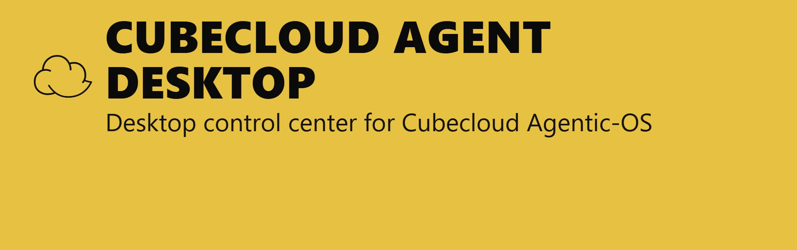

> **Cubecloud Agent Desktop — 데스크톱 바이너리 문서입니다.**
> Agentic-OS 모노레포 README 는 [`../README.md`](../README.md),
> 마스터 인덱스는 [`../docs/HANDBOOK.md`](../docs/HANDBOOK.md)에 있습니다.
> 라이선스, 브랜드, 기여 정책은 [`../BRANDING_AND_LICENSE.md`](../BRANDING_AND_LICENSE.md)를 참고하세요.



<br/>
<p align="center">
  <a href="../docs/HANDBOOK.md"></a>
  <a href="https://t.me/hermes_agent_desktop"></a>
  <a href="LICENSE"></a>
  <a href="docs/legal/TRADEMARK_POLICY.md"></a>
  <a href="SECURITY.md"></a>
  <a href="CONTRIBUTING.md"></a>
  <a href="https://github.com/cubecloud-contributors/cubecloud-agentic-os/releases/"></a>
  <a href="https://github.com/cubecloud-contributors/cubecloud-agentic-os/stargazers"></a>
  <a href="https://github.com/cubecloud-contributors/cubecloud-agentic-os/releases/"></a>
</p>

<p align="center">
  <a href="README.md">English</a> ·
  <a href="README.zh-CN.md">简体中文</a> ·
  <a href="README.ja-JP.md">日本語</a> ·
  <a href="README.ko-KR.md">한국어</a>
</p>

# Cubecloud Agent Desktop — 바이너리 배포본

Cubecloud Agent Desktop 는 Cubecloud Agentic-OS 모노레포를 위한 네이티브 데스크톱 제어 센터입니다. 로컬 또는 원격 에이전트 런타임을 하나의 GUI 안에 감싸서 사용자가 CLI 를 직접 관리하지 않아도 되도록 만듭니다.

## 사용자가 실제로 보게 되는 것

- 진행 상태와 의존성 해결을 포함한 가이드형 첫 실행 설치 흐름
- **멀티 프로바이더** 선택기 — OpenRouter, Anthropic, OpenAI, Google (Gemini), xAI (Grok), Nous Portal, Qwen, MiniMax, Hugging Face, Groq, 그리고 **모든 OpenAI 호환 엔드포인트** (LM Studio, Atomic Chat, Ollama, vLLM, llama.cpp)
- SSE 스트리밍, 도구 진행 상태, Markdown 렌더링, 문법 하이라이팅을 갖춘 **스트리밍 채팅 UI**
- **토큰 사용량 추적** — 채팅 하단에서 프롬프트/완성 토큰 수와 비용을 실시간으로 확인하고 `/usage` 명령으로 다시 조회
- **22개의 슬래시 명령어** — `/new`, `/clear`, `/fast`, `/web`, `/image`, `/browse`, `/code`, `/shell`, `/usage`, `/help`, `/tools`, `/skills`, `/model`, `/memory`, `/persona`, `/version`, `/compact`, `/compress`, `/undo`, `/retry`, `/debug`, `/status` 등
- **세션 관리** — SQLite FTS5 기반 전체 검색, 날짜별 이력 그룹화, 대화 재개와 교차 검색
- **프로필 전환** — 서로 격리된 에이전트 환경을 생성, 삭제, 전환
- **14개 도구 세트** — 웹, 브라우저, 터미널, 파일, 코드 실행, 비전, 이미지 생성, TTS, 스킬, 메모리, 세션 검색, clarify, delegation, MoA, 작업 계획
- **메모리 시스템** — 메모리 항목과 사용자 프로필 메모리를 열람/편집하고 용량을 추적하며 메모리 프로바이더(Honcho, Hindsight, Mem0, RetainDB, Supermemory, ByteRover)를 구성
- **페르소나 편집기** — 에이전트의 `SOUL.md` 퍼스널리티를 편집하거나 초기화
- **저장된 모델 관리** — 프로바이더별 모델 설정 CRUD
- **예약 작업** — 분/시간/일/주/사용자 정의 cron 과 15개 전달 대상을 지원하는 스케줄 빌더
- **16개 메시징 게이트웨이** — Telegram, Discord, Slack, WhatsApp, Signal, Matrix, Mattermost, Email (IMAP/SMTP), SMS (Twilio/Vonage), iMessage (BlueBubbles), DingTalk, Feishu/Lark, WeCom, WeChat (iLink Bot), Webhooks, Home Assistant
- **Hermes Office (Claw3d)** — 개발 서버와 어댑터 관리를 포함한 시각적 3D 인터페이스
- **백업, 가져오기, 디버그 덤프** — Settings 화면에서 전체 데이터 백업/복원과 시스템 진단 실행
- **로그 뷰어** — Settings 에서 게이트웨이와 에이전트 로그 직접 확인
- **자동 업데이트** — `electron-updater` 기반 업데이트 확인과 설치
- **i18n 준비 완료** — 전체 화면을 덮는 영어 로케일과 커뮤니티 번역을 위한 국제화 프레임워크
- **테스트 스위트** — Vitest 기반 SSE 파서, IPC 핸들러, preload API, 설치 유틸리티, 상수 검증

## 설치

<p align="center">
  <a href="https://github.com/cubecloud-contributors/cubecloud-agentic-os/releases/">
    
  </a>
</p>

자세한 설치 및 첫 실행 흐름은 [`../docs/handbook/OPERATIONS.md`](../docs/handbook/OPERATIONS.md)에 정리되어 있습니다. 요약하면 다음과 같습니다.

### Windows

> **Windows 사용자:** 설치 프로그램은 코드 서명되어 있지 않습니다. 첫 실행 시 Windows SmartScreen 경고가 표시되면 "추가 정보" → "실행"을 선택하세요.

### Fedora (RPM)

```bash
sudo dnf install ./cubecloud-desktop-<version>.rpm
```

> **Fedora 사용자:** `.rpm` 파일은 GPG 서명되어 있지 않습니다. 시스템이 서명 검증을 강제하면 `--nogpgcheck` 를 덧붙이세요. `.rpm` 빌드는 `electron-updater` 제약 때문에 자동 업데이트를 지원하지 않으므로 새 `.rpm` 을 다시 설치해야 합니다.

## 미리보기

아래 이미지는 현재 데스크톱 빌드에서 캡처한 전체 페이지 스크린샷입니다. 첫 실행 흐름, 런타임 감지, 그리고 사이드바의 주요 작업 화면을 모두 포함합니다.

<table>
<tr>
<td width="50%" align="center"><b>Welcome</b><br/></td>
<td width="50%" align="center"><b>Remote gateway</b><br/></td>
</tr>
<tr>
<td width="50%" align="center"><b>SSH handoff</b><br/></td>
<td width="50%" align="center"><b>Runtime detection</b><br/></td>
</tr>
<tr>
<td width="50%" align="center"><b>Chat</b><br/></td>
<td width="50%" align="center"><b>Sessions</b><br/></td>
</tr>
<tr>
<td width="50%" align="center"><b>Profiles</b><br/></td>
<td width="50%" align="center"><b>Persona</b><br/></td>
</tr>
<tr>
<td width="50%" align="center"><b>Plans</b><br/></td>
<td width="50%" align="center"><b>CodeGraph</b><br/></td>
</tr>
<tr>
<td width="50%" align="center"><b>EverOS</b><br/></td>
<td width="50%" align="center"><b>Headroom</b><br/></td>
</tr>
<tr>
<td width="50%" align="center"><b>Models</b><br/></td>
<td width="50%" align="center"><b>Providers</b><br/></td>
</tr>
<tr>
<td width="50%" align="center"><b>Skills</b><br/></td>
<td width="50%" align="center"><b>Memory</b><br/></td>
</tr>
<tr>
<td width="50%" align="center"><b>Tools</b><br/></td>
<td width="50%" align="center"><b>Workspace</b><br/></td>
</tr>
<tr>
<td width="50%" align="center"><b>Schedules</b><br/></td>
<td width="50%" align="center"><b>Gateway</b><br/></td>
</tr>
<tr>
<td width="50%" align="center"><b>MCP</b><br/></td>
<td width="50%" align="center"><b>Settings</b><br/></td>
</tr>
</table>

## 작동 방식

앱을 처음 실행하면 다음 순서로 진행됩니다.

1. 에이전트를 **로컬**에서 실행할지, **원격** API 서버에 연결할지 묻습니다.
2. **로컬 모드:** 런타임이 이미 설치되어 있는지 확인하고, 없다면 의존성 해결과 함께 공식 설치기를 실행합니다.
3. **원격 모드:** 원격 API URL 과 키를 입력받아 연결을 검증하고 로컬 설치를 건너뜁니다.
4. API 프로바이더 또는 로컬 모델 엔드포인트를 선택합니다.
5. 프로바이더 설정과 API 키를 런타임 설정 파일에 저장합니다.
6. 설정이 끝나면 메인 워크스페이스를 엽니다.

로컬 모드에서는 `http://127.0.0.1:8642` 로 SSE 스트리밍 요청을 보냅니다. 원격 모드에서는 설정한 URL 로 같은 스트리밍 프로토콜을 사용합니다. 데스크톱 앱은 도구 진행 상태, Markdown 내용, 토큰 사용량을 스트림이 도착하는 즉시 렌더링합니다.

## 지원 프로바이더

### LLM 프로바이더

| Provider | Notes |
| --- | --- |
| **OpenRouter** | 하나의 API 로 200개 이상의 모델 사용 (권장) |
| **Anthropic** | Claude 직접 사용 |
| **OpenAI** | GPT 직접 사용 |
| **Google (Gemini)** | Google AI Studio |
| **xAI (Grok)** | Grok 모델 |
| **Nous Portal** | 무료 티어 제공 |
| **Qwen** | QwenAI 모델 |
| **MiniMax** | 글로벌 / 중국 엔드포인트 |
| **Hugging Face** | HF Inference 로 20개 이상의 오픈 모델 |
| **Groq** | 빠른 추론 (voice/STT) |
| **Local / Custom** | 모든 OpenAI 호환 엔드포인트 |

LM Studio, Atomic Chat, Ollama, vLLM, llama.cpp 용 로컬 프리셋이 포함되어 있습니다.

### 메시징 플랫폼

Telegram, Discord, Slack, WhatsApp, Signal, Matrix / Element, Mattermost, Email (IMAP / SMTP), SMS (Twilio & Vonage), iMessage (BlueBubbles), DingTalk, Feishu / Lark, WeCom, WeChat (iLink Bot), Webhooks, Home Assistant.

### 도구 연동

Exa Search, Parallel API, Tavily, Firecrawl, FAL.ai (image generation), Honcho, Browserbase, Weights & Biases, Tinker.

## 개발

### 사전 요구 사항

- Node.js 와 npm
- 런타임 설치기를 실행할 수 있는 Unix 계열 셸 환경
- 첫 실행 설치 중 런타임 다운로드를 위한 네트워크 접근

### 의존성 설치

```bash
npm install
```

### 개발 모드 실행

```bash
npm run dev
```

## 다음에 볼 곳

- **모노레포 README** — [`../README.md`](../README.md)
- **마스터 핸드북** — [`../docs/HANDBOOK.md`](../docs/HANDBOOK.md)
- **주제별 심화 문서** — [`../docs/handbook/`](../docs/handbook/)
- **라이선스 / 브랜드** — [`../LICENSE`](../LICENSE), [`../BRANDING_AND_LICENSE.md`](../BRANDING_AND_LICENSE.md)
- **활성 / 스크래치 / 미러 인덱스** — [`../docs/RETIRED_AND_LEGACY.md`](../docs/RETIRED_AND_LEGACY.md)
- **스킬 생태계** — [`../.agents/skills/README.md`](../.agents/skills/README.md)
- **Cubecloud 런타임 래퍼** — [`../docs/CODEGRAPH-RUNTIME.md`](../docs/CODEGRAPH-RUNTIME.md), [`../docs/EVEROS-SIDECAR.md`](../docs/EVEROS-SIDECAR.md)

## 라이선스

Cubecloud 고유 작업물은 **AGPL-3.0-or-later, Apache-2.0, MIT** 중 하나를 선택해 사용할 수 있습니다. Cubecloud 모듈을 담고 있는 상속된 `hermes-desktop` 프레임워크 코드는 계속 MIT 로 유지됩니다. 경로별 구분과 버전별 전환 이력은 [`../LICENSE`](../LICENSE) 와 [`../BRANDING_AND_LICENSE.md`](../BRANDING_AND_LICENSE.md) 를 참고하세요.
