<p align="center">
  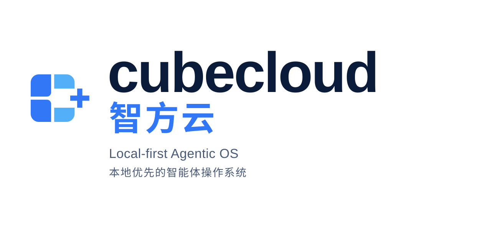
</p>

# Cubecloud Agent Desktop — the binary

> **This is the install + features doc for the desktop binary.** The
> agentic-OS monorepo README lives at
> [`../README.md`](../README.md); the master index for *what this is,
> why it is the way it is, and where to look next* lives at
> [`../docs/HANDBOOK.md`](../docs/HANDBOOK.md).

Cubecloud Agent Desktop is the native desktop control center for the
Cubecloud Agentic-OS monorepo. It wraps a local or remote agent
runtime in a single GUI so the user does not have to manage the CLI
by hand.

## What the user sees

- A guided first-run install for the agent runtime with progress tracking and dependency resolution
- A **multi-provider** provider picker — OpenRouter, Anthropic, OpenAI, Google (Gemini), xAI (Grok), Nous Portal, Qwen, MiniMax, Hugging Face, Groq, and **any OpenAI-compatible endpoint** (LM Studio, Atomic Chat, Ollama, vLLM, llama.cpp)
- A **streaming chat UI** with SSE streaming, tool progress indicators, markdown rendering, and syntax highlighting
- **Token usage tracking** — live prompt/completion token counts and cost display in the chat footer, plus a `/usage` slash command
- **22 slash commands** — `/new`, `/clear`, `/fast`, `/web`, `/image`, `/browse`, `/code`, `/shell`, `/usage`, `/help`, `/tools`, `/skills`, `/model`, `/memory`, `/persona`, `/version`, `/compact`, `/compress`, `/undo`, `/retry`, `/debug`, `/status`, and more
- **Session management** — full-text search (SQLite FTS5), date-grouped history, resume and search across conversations
- **Profile switching** — create, delete, and switch between separate agent environments with isolated config
- **14 toolsets** — web, browser, terminal, file, code execution, vision, image gen, TTS, skills, memory, session search, clarify, delegation, MoA, and task planning
- **Memory system** — view/edit memory entries, user profile memory, capacity tracking, and discoverable memory providers (Honcho, Hindsight, Mem0, RetainDB, Supermemory, ByteRover)
- **Persona editor** — edit and reset your agent's SOUL.md personality
- **Saved models** — CRUD management for model configurations across providers
- **Scheduled tasks** — cron job builder (minutes, hourly, daily, weekly, custom cron) with 15 delivery targets
- **16 messaging gateways** — Telegram, Discord, Slack, WhatsApp, Signal, Matrix, Mattermost, Email (IMAP/SMTP), SMS (Twilio/Vonage), iMessage (BlueBubbles), DingTalk, Feishu/Lark, WeCom, WeChat (iLink Bot), Webhooks, Home Assistant
- **Hermes Office (Claw3d)** — visual 3D interface with dev server and adapter management
- **Backup, import & debug dump** — full data backup/restore and system diagnostics from Settings
- **Log viewer** — view gateway and agent logs directly from the Settings screen
- **Auto-updater** — check for and install updates via `electron-updater`
- **i18n ready** — internationalization framework with English locale covering all screens, ready for community translations
- **Test suite** — SSE parser, IPC handlers, preload API surface, installer utilities, and constants validation with Vitest

## Preview

Every image below is a full-page capture from the current desktop build.
The gallery covers onboarding, runtime discovery, and every major
operator surface exposed in the sidebar.

<table>
<tr>
<td width="50%" align="center"><b>Welcome</b><br/></td>
<td width="50%" align="center"><b>Remote gateway</b><br/>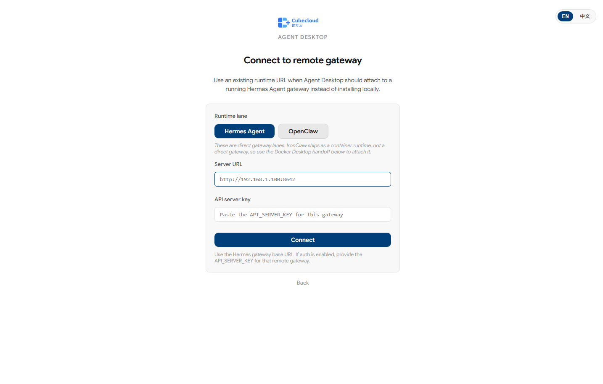</td>
</tr>
<tr>
<td width="50%" align="center"><b>SSH handoff</b><br/>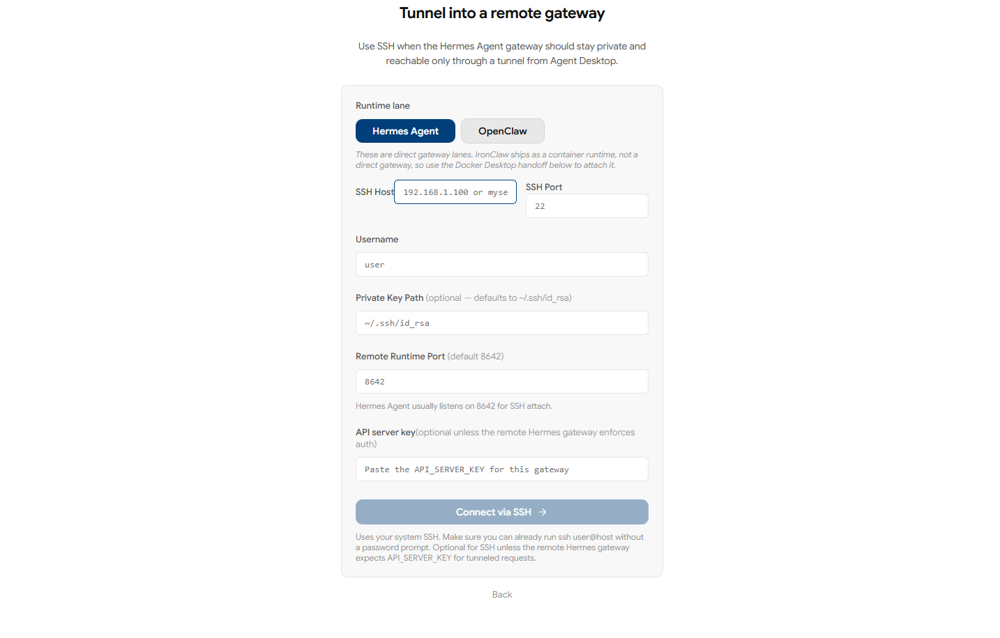</td>
<td width="50%" align="center"><b>Runtime detection</b><br/></td>
</tr>
<tr>
<td width="50%" align="center"><b>Chat</b><br/></td>
<td width="50%" align="center"><b>Sessions</b><br/>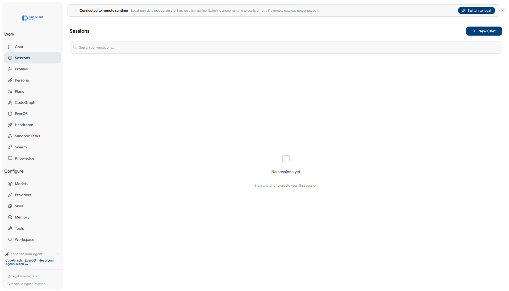</td>
</tr>
<tr>
<td width="50%" align="center"><b>Profiles</b><br/></td>
<td width="50%" align="center"><b>Persona</b><br/>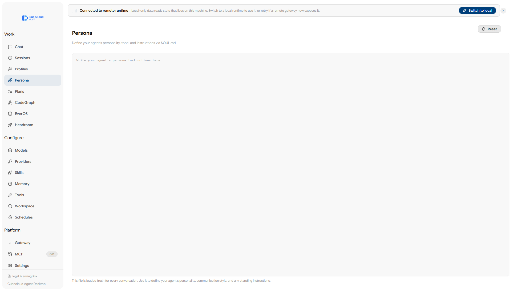</td>
</tr>
<tr>
<td width="50%" align="center"><b>Plans</b><br/>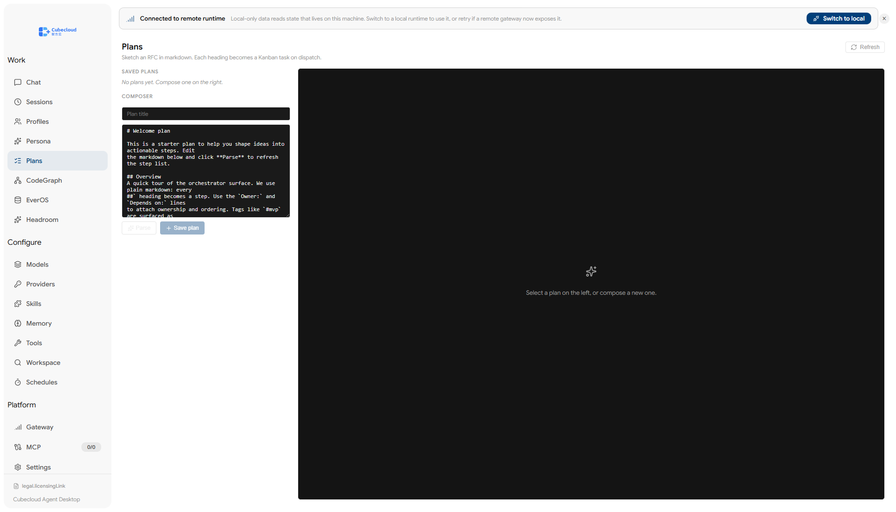</td>
<td width="50%" align="center"><b>CodeGraph</b><br/>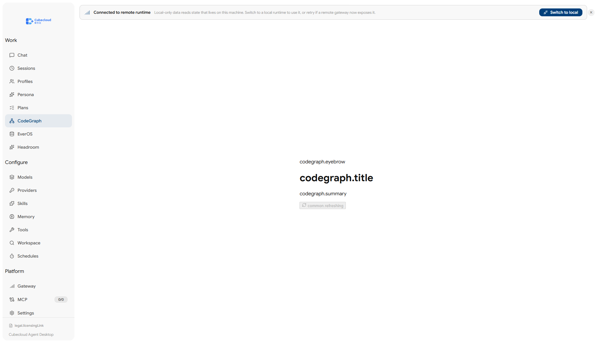</td>
</tr>
<tr>
<td width="50%" align="center"><b>EverOS</b><br/>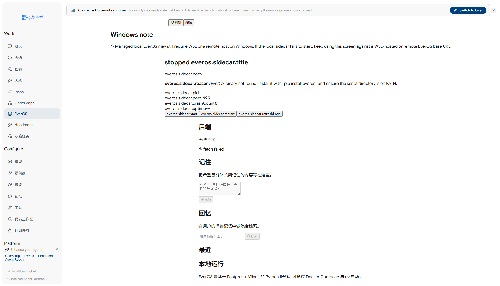</td>
<td width="50%" align="center"><b>Headroom</b><br/>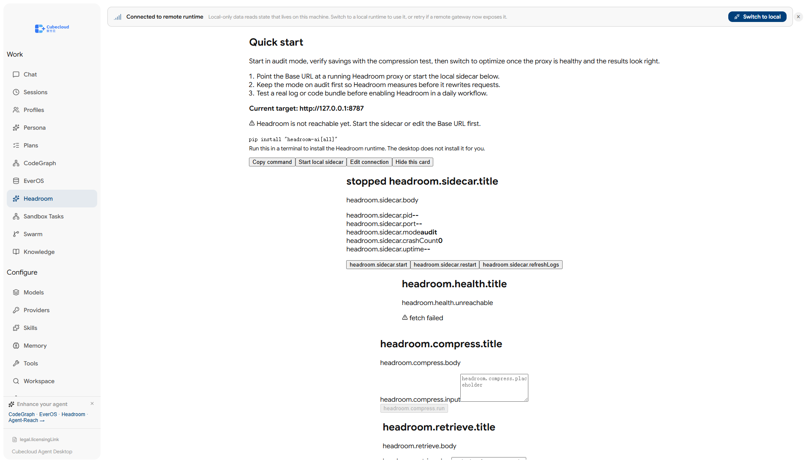</td>
</tr>
<tr>
<td width="50%" align="center"><b>Models</b><br/>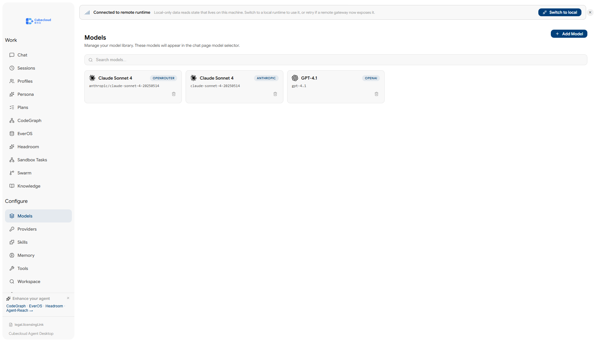</td>
<td width="50%" align="center"><b>Providers</b><br/>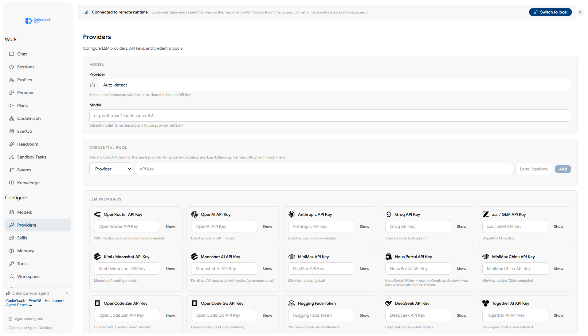</td>
</tr>
<tr>
<td width="50%" align="center"><b>Skills</b><br/>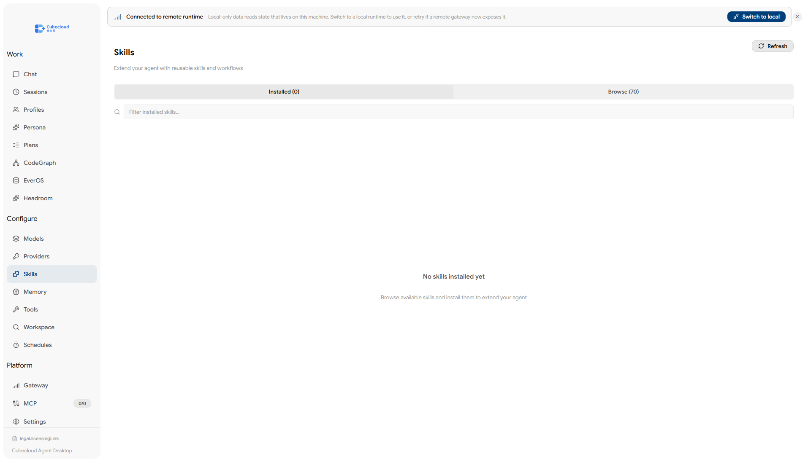</td>
<td width="50%" align="center"><b>Memory</b><br/>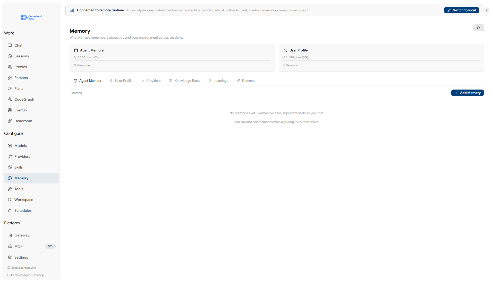</td>
</tr>
<tr>
<td width="50%" align="center"><b>Tools</b><br/>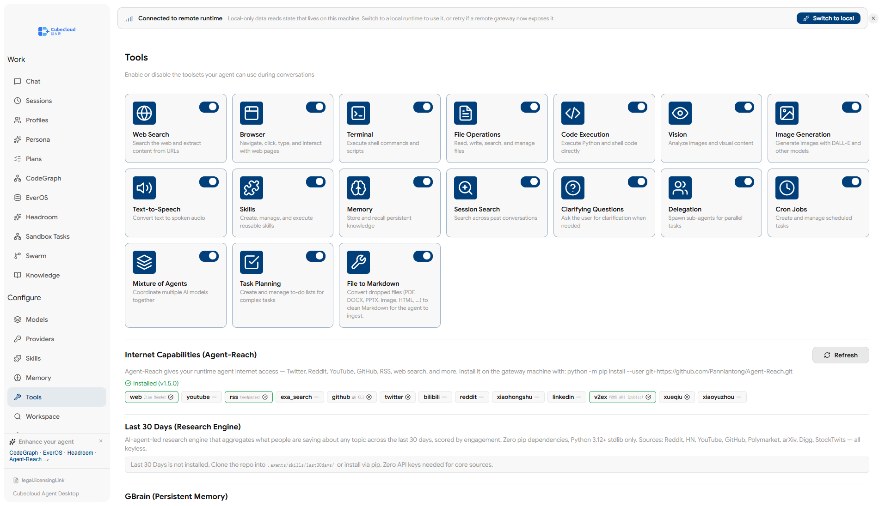</td>
<td width="50%" align="center"><b>Workspace</b><br/>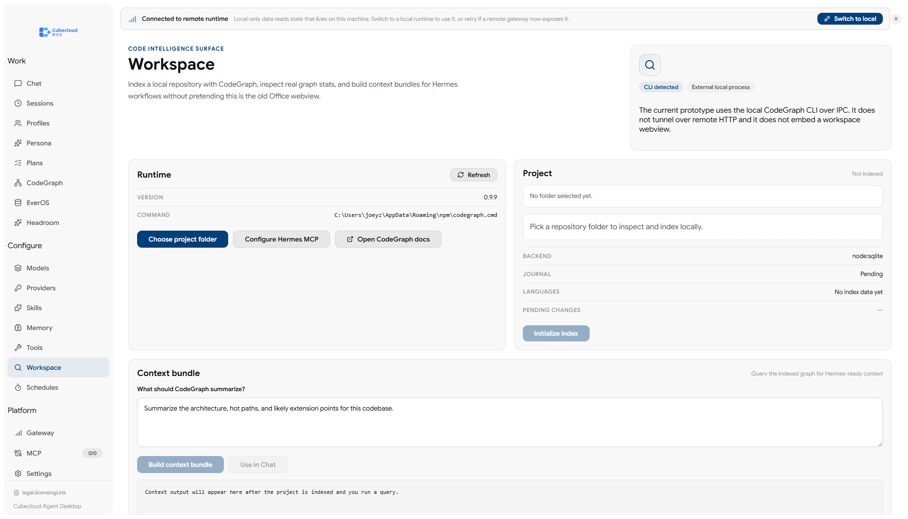</td>
</tr>
<tr>
<td width="50%" align="center"><b>Schedules</b><br/>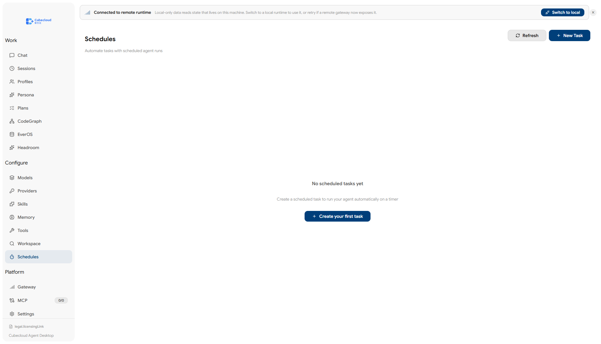</td>
<td width="50%" align="center"><b>Gateway</b><br/></td>
</tr>
<tr>
<td width="50%" align="center"><b>MCP</b><br/>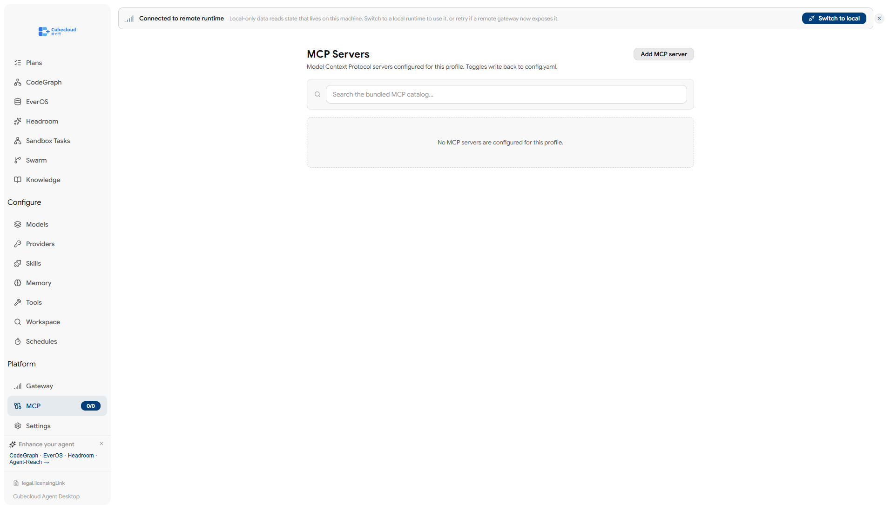</td>
<td width="50%" align="center"><b>Settings</b><br/></td>
</tr>
</table>

## Install

The install + first-run flow is documented in detail in
[`../docs/handbook/OPERATIONS.md`](../docs/handbook/OPERATIONS.md). The
short version:

### Windows

> **Windows users:** The installer is not code-signed. Windows SmartScreen
> will warn on first launch — click "More info" → "Run anyway".

### Fedora (RPM)

```bash
sudo dnf install ./cubecloud-desktop-<version>.rpm
```

> **Fedora users:** The `.rpm` is not GPG-signed. If your system enforces
> signature checking, append `--nogpgcheck` to the install command.
> Auto-update is not supported for `.rpm` builds (limitation of
> `electron-updater`); reinstall the new `.rpm` to update.

## How it works

On first launch, the app:

1. Asks whether you want to run the agent **locally** or connect to a **remote** API server.
2. **Local mode:** checks whether the runtime is already installed; if not, runs the official installer with dependency resolution.
3. **Remote mode:** prompts for the remote API URL and API key, validates the connection, and skips local install.
4. Prompts for an API provider or local model endpoint.
5. Saves provider config and API keys through the runtime's config files.
6. Launches the main workspace once setup is complete.

In local mode, chat requests go through `http://127.0.0.1:8642` with SSE
streaming. In remote mode, the app talks to your configured remote URL
with the same streaming protocol. The desktop app parses the stream in
real time, rendering tool progress, markdown content, and token usage
as it arrives.

## Supported providers

### LLM providers

| Provider            | Notes                                    |
| ------------------- | ---------------------------------------- |
| **OpenRouter**      | 200+ models via single API (recommended) |
| **Anthropic**       | Direct Claude access                     |
| **OpenAI**          | Direct GPT access                        |
| **Google (Gemini)** | Google AI Studio                         |
| **xAI (Grok)**      | Grok models                              |
| **Nous Portal**     | Free tier available                      |
| **Qwen**            | QwenAI models                            |
| **MiniMax**         | Global and China endpoints               |
| **Hugging Face**    | 20+ open models via HF Inference         |
| **Groq**            | Fast inference (voice/STT)               |
| **Local / Custom**  | Any OpenAI-compatible endpoint           |

Local presets are included for LM Studio, Atomic Chat, Ollama, vLLM,
and llama.cpp.

### Messaging platforms

Telegram, Discord, Slack, WhatsApp, Signal, Matrix / Element,
Mattermost, Email (IMAP / SMTP), SMS (Twilio & Vonage), iMessage
(BlueBubbles), DingTalk, Feishu / Lark, WeCom, WeChat (iLink Bot),
Webhooks, and Home Assistant.

### Tool integrations

Exa Search, Parallel API, Tavily, Firecrawl, FAL.ai (image generation),
Honcho, Browserbase, Weights & Biases, and Tinker.

## Development

### Prerequisites

- Node.js and npm
- A Unix-like shell environment for the runtime installer
- Network access for downloading the runtime during first-run install

### Install dependencies

```bash
npm install
```

### Start the app in development mode

```bash
npm run dev
```

## Where to look next

- **The agentic-OS monorepo README** — [`../README.md`](../README.md)
- **The master handbook** — [`../docs/HANDBOOK.md`](../docs/HANDBOOK.md) (one-screen tour)
- **The long-form per-topic deep dives** — [`../docs/handbook/`](../docs/handbook/) (architecture, development, operations)
- **The license / brand** — [`../LICENSE`](../LICENSE) and [`../BRANDING_AND_LICENSE.md`](../BRANDING_AND_LICENSE.md)
- **The live / scratch-pad / mirror index** — [`../docs/RETIRED_AND_LEGACY.md`](../docs/RETIRED_AND_LEGACY.md)
- **The skills ecosystem** — [`../.agents/skills/README.md`](../.agents/skills/README.md) (34 skills, mirrored to `~/.agents/skills/`)
- **The Cubecloud runtime wrappers** — [`../docs/CODEGRAPH-RUNTIME.md`](../docs/CODEGRAPH-RUNTIME.md), [`../docs/EVEROS-SIDECAR.md`](../docs/EVEROS-SIDECAR.md)
- **The 34-skill ecosystem's per-version history** — [`../BRANDING_AND_LICENSE.md`](../BRANDING_AND_LICENSE.md) §"V2.6 / V2.7 / V2.8 / V2.9 transitions landed"

## License

Cubecloud-original work is dual-licensed under your choice of
**AGPL-3.0-or-later, Apache-2.0, or MIT**. The inherited
`hermes-desktop` framework code that hosts the Cubecloud-original
modules remains hard-MIT. See [`../LICENSE`](../LICENSE) and
[`../BRANDING_AND_LICENSE.md`](../BRANDING_AND_LICENSE.md) for the
per-path breakdown and the per-version transition history.
